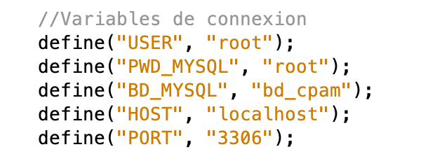

# Projet_BAAAAAM
Projet de conception et développement d'une application web pour la dématérialisation des arrêts de travail avec la CPAM de la Haute-Garonne.

Visible ici https://teambaaaaam.github.io/Projet_BAAAAAM/
<h3>Configuration minimale</h3>

SGBD : MySQL (version 5.7.56 ou ultérieure)

Bootstrap 3 (version 3.4.1 ou ultérieure)

PHP (version 5.4 ou ultérieure)

<h3>Installation</h3>
<ul><li>Clonage du répertoire en local</li>

Dans un terminal, taper la commande suivante :
  git clone <a href="https://github.com/TeamBAAAAAM/Projet_BAAAAAM.git">https://github.com/TeamBAAAAAM/Projet_BAAAAAM.git</a> 

Il est également possible d’utiliser le lien suivant https://github.com/TeamBAAAAAM/Projet_BAAAAAM.git pour cloner le dossier contenant les différentes pages à l’aide d’un IDE.

<li>Création de la base de données</li>

 Script de création : <a href="bd_cpam/ScriptCreationBD.sql">ScriptCreationBD.sql</a>

<li>Accès à la base de données</li>

Dans le fichier <a href="fonctions.php">fonctions.php</a>, vérifier les variables de connexion et les modifier si nécessaire

</ul>

 La variable globale 'STORAGE_PATH' correspond au chemin menant au dossier de destination des fichiers enregistrés. 

 La valeur de 'STORAGE_PATH' est à définir au début du fichier 'fonctions.php'. 

