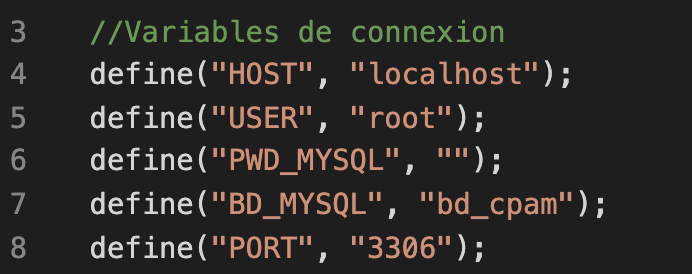

# Projet_BAAAAAM
Projet de conception et développement d'une application web pour la dématérialisation des arrêts de travail avec la CPAM de la Haute-Garonne.

Visible ici https://teambaaaaam.github.io/Projet_BAAAAAM/
<h3>Configuration minimale</h3>

SGBD : MySQL (version 5.7.56 ou ultérieure)

Bootstrap 3 (version 3.4.1 ou ultérieure)

PHP (version 5.4 ou ultérieure)

<h3>Installation</h3>
<ul><li>Clonage du répertoire en local</li>

Dans un terminal, taper la commande suivante :
  git clone <a href="https://github.com/TeamBAAAAAM/Projet_BAAAAAM.git">https://github.com/TeamBAAAAAM/Projet_BAAAAAM.git</a> 

Il est également possible d’utiliser le lien suivant https://github.com/TeamBAAAAAM/Projet_BAAAAAM.git pour cloner le dossier contenant les différentes pages à l’aide d’un IDE.

<li>Création de la base de données</li>

 Script de création : <a href="bd_cpam/ScriptCreationBD.sql">ScriptCreationBD.sql</a>

<li>Accès à la base de données</li>

Dans le fichier <a href="fonctions.php">fonctions.php</a>, vérifier les variables de connexion et les modifier si nécessaire

<li>Initialisation de SENDGRID</li>

Pour initialiser SendGrid, il faut effectuer les étapes suivantes :

  <ol>
    <li>Créer tout d'abord un compte sur <a href="https://signup.sendgrid.com/">SendGrid</a> ;</li>
    <li>Dans le menu de gauche, aller sur "Email API" > "Integration Guide"</a> ;</li>
    <li>Dans la zone "Integrate using our Web API or SMTP Relay", choisir l'option Web API en cliquant sur "Choose" ;</li>
    <li>Puis sélectionner "PHP" comme langage puis valider;</li>
    <li>Dans le champ "My First API Key Name", entrer un nom quelconque puis cliquer sur "Create a Key" ;</li>
    <li>Copier la clé qui vient d'être créée (de la forme "SG.g5TUG ... QVC21Qogc-4PB1uUA") ;</li>
    <li>Aller dans le fichier "fonctions.php" visible à la racine du dossier et coller la clé comme valeur de "SENDGRID_API_KEY" (ligne 33 ou plus)) ;</li>
    <li>Copier la clé qui vient d'être créée (de la forme "SG.g5TUG ... QVC21Qogc-4PB1uUA") ;</li>
    <li>Tout en bas, cliquer la case à cocher "I've integrated the code above" puis sur le bouton "Next: Verify integration" ;</li>
    <li>Dans le menu de gauche, aller sur "Sender Authentification", puis cliquer sur "Verify a Single Sender" et renseigner les champs en précisant une adresse d'expéditeur valide (validation par la suite) puis valider votre mail ;</li>
    <li>Une fois validée, affecter votre adresse mail, dans le fichier "fonctions.php", à la variable "SENDER_EMAIL_ADDRESS" (ligne 34 ou plus) ; </li>
    <li>Enfin, insérer le fichier <a href="https://curl.haxx.se/ca/cacert.pem">cacert.pem</a> à l'emplacement suivant : 
      "[Disque_Admin]:\wamp64\bin\php\php[Version_PHP]\extras\ssl" (exemple sur WampServer, à adapter selon le logiciel) ;
    </li>
  </ol>
</ul>

 La variable globale 'STORAGE_PATH' correspond au chemin menant au dossier de destination des fichiers enregistrés. 

 La valeur de 'STORAGE_PATH' est à définir au début du fichier 'fonctions.php'. 

